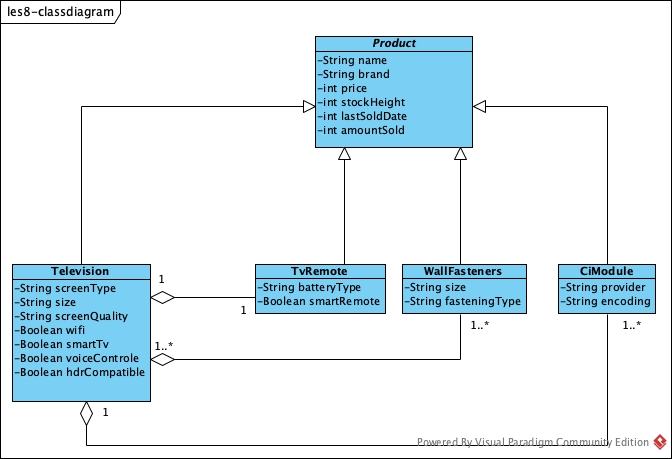

## Samenvatting

TechITEasy bv wil een applicatie met de volgende punten erin:

- ze hebben 4 soorten producten, TV's , afstandsbedieningen, muurbeugels en CI-modules.
- onderscheid in rechten binnen app. Hella, Paulus en Robin alles mogelijk. Rest beperkt.
- volgende (voor alle) productkenmerken; naam, merk, type, prijs en mogelijkheden.
- voor tv nog extra; schermtype, formaat, schermkwaliteit
    - ja/nee feiten; wifi, smart tv, voice controle en hdr compatible.
- voor afstandbediening extra; batterijtype, smart remote is ja/nee.
- voor muurbeugels extra; formaat en bevestigingsmethode.
- voor CI-module extra; provider, encoding.
- bijhouden wat de voorraad is en daarvan verkocht is en wanneer.
- 'wordt vaak samen gekocht met' sectie.

Relaties tussen diverse producten:

- voor elke tv maar 1 afstandsbediening
- ook 1 afstandsbediening per tv
- een soort ci-module past op meerdere tv's
- 1 tv kan maar 1 ci-module hebben
- beugels die voor meerdere tv's beschikbaar zijn
- een tv meerdere beugels hebben

## User stories

1. Als verkoper wil ik de huidige voorraad kunnen zien zodat ik reclame kan maken met modellen die wij uit voorraad
   leverbaar hebben.
2. Als eigenaar wil ik een rechtenscheiding in de applicatie zodat niet elke medewerker gevoelige gegevens kan aanpassen
   of inzien.
3. Als verkoper wil ik dat producten die bij elkaar horen gelinkt zijn aan elkaar zodat ik de klant met een zo compleet
   mogelijk pakket adviseer.

## Functionele eisen

1. Als medewerker kan je inloggen.
2. Als admin heb je de rechten om personeelsgegevens aan te passen.
3. De applicatie houdt bij hoe hoog de voorraad is.
4. De applicatie slaat voor alle producten de naam, type, merk, prijs en mogelijkheden op.
5. Als verkoper kan je precies zien waar elk product staat en wanneer die voor het laatst is binnengekomen.
6. De applicatie laat per product zien wanneer deze precies verkocht is.
7. Als nieuwe medewerker kan je je registreren.
8. Als magazijnbeheerder kan je correcties maken aan in je voorraad.
9. Als verkoopleider kan je prijsaanpassingen doorvoeren.
10. De applicatie houdt bij welke producten bij elkaar passen.

## Niet Functionele eisen

1. De applicatie ververst de voorraadstand elk kwartier.
2. De producten staan gecategoriseerd bij elkaar.
3. Elke keer als je de applicatie opent moet je inloggen met je persoonlijke code.
4. Personeelsgegevens is een afgeschermd gedeelte in de applicatie alleen voor admin gebruikers.
5. Producten die op voorraad liggen zullen als eerste getoond worden.

## Klassendiagram

